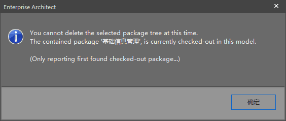

先来引用一段 Hexo 中文文档中的一段话。
> 通过常规的 markdown 语法和相对路径来引用图片和其它资源可能会导致它们在存档页或者主页上显示不正确。在Hexo 2时代，社区创建了很多插件来解决这个问题。但是，随着Hexo 3 的发布，许多新的标签插件被加入到了核心代码中。这使得你可以更简单地在文章中引用你的资源。

```



```
按照上面说的引用方式，文章中的图片无论是在首页还是文章详情页显示都不会有问题的。可是，在使用可视化 Markdown 编辑工具（如：Typora）的时候图片是显示不出来的，只能在 Hexo 的本地 Server 里才能看到效果。另外，如果想把 md 文件导出为PDF或是word文档，那不好意思你只能去把图的引用方式修改为标准的 Markdown 插入图片语法。

因为在不同的环境中都有各自的语法支持，如：`{/% asset_img slug [title] %}` 仅在 Hexo 中可解释。我自己想出了个办法，就是利用这种再不同环境中对语法支持不同，写段能自适应的图片引用方式，代码如下：

```

  {## 这个只在 Hexo 环境中有效 ##}
  

  {## 这是原生的 Markdown 插入图片语法 ##}
  

```

因为 Markdown 是不支持`{/% %}`这种标签的解析，所以在纯 Markdown 解析环境中会把上面代码中那些 Hexo 中有效的标签都忽略掉。那么就只剩下原生的 Markdown 插入图片语法了。

空模板
```
 
  

  

```

# 终极大招

如果这样感觉还是很费劲，那么还有终极大招！！！

那就是用图床吧，使用http绝对路径为图片的地址。

推荐大家使用七牛的对象存储服务（[七牛官网](https://portal.qiniu.com/signup?code=3lkz9nbfo4guq)），本站使用的就是这个。


