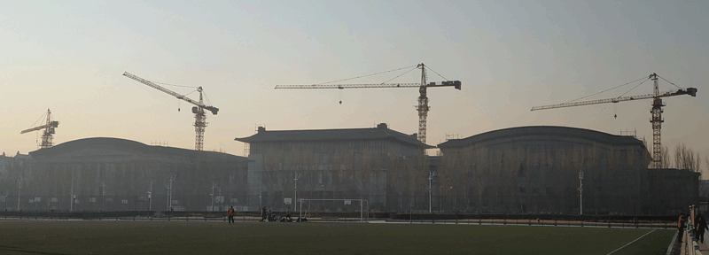

时间：2019年3月3日 星期日

天气：温度 -9°，微风，空气质量指数 247 中度污染

这是2019高校跑的第二站哈尔滨工程大学。

早上6点出发，大约半个小时后来到文庙（领票处）门口。戴好帽子、手套、耳机，往“Keep哈尔滨”微信里发个位置，出发！

# 进校园

做完跑前热身，从文庙门前的文庙街自西向东开始跑。记得这条路是可以进到校园内的。

')

途中经过黑龙江省军区门前，拍照的时候警觉的哨兵一直在盯着我，看的我好不自在。

可跑到头的时候傻眼了，有个栅栏门封住了去路。

这时体会到驴友到未知的领域，前不着村后不着店，会遇到多少困难，多么无助的感觉了。。
本想掉头往回跑，可就算跑回到出发的地方，这大早上的，也找不到问路的人，还是不知道怎么进校园。这个时候发现栅栏门的左侧旁有路口，不管了，往这里去看看能不能进去吧。左转、右转、往前到头，有个大铁门上写着“不通学校”，没办法有往右转，跑到头是墙，没有路了。原路返回，到刚才那个大铁门的时候，看见有两个大娘在从铁门旁边的一个很不起眼的小门那迈过个铁桩子。我也抱着碰碰运气的想法去过看看，过了这个门就豁然开朗了，真的能进去！

# 北体育场

过了小门就是校园内的东海路，顺着东海路自南向北第一个路口就是南海路，拐入南海路就可以看见北体育场了。哈工程的北体育场看着和哈工大的主体育场差不多。有看台有主席台。可和哈工大一样都是锁着门的，可能只有专业的体育生训练的时候才能进去吧。只能在北体育场外绕了一圈，有个门缝比较大，手伸进去拍了下面这张照片。

# 体育馆

对哈工程的体育馆印象还是很深刻的，因为第一次去室内篮球馆就是在这里。那还是在初中的时候，骑自行车从现在群力那的省五院到哈工程体院馆，大概有16公里多的路程。那个时候的体力真好。记得那时候有早场、上午场、下午场。我们经常去的是上午场，记得好像是5块钱3小时吧。那个时候经常出席的还真不多少，有些现在都记不起名字了，反正36中打篮球的都是这帮人。还有玻璃瓶装的大白梨，人多时候时候还抬一箱。

而现在正在改建修缮中。

# 篮球场4
体育馆门前就是篮球场了，不过这时候篮球场里面空空荡荡。

# 军工操场
篮球场的北面是军工操场（足球场），场地非常不错，已经有一队人在踢得火热了。

')

# 南体育场

南体育场是个一圈400米的标准田径场，跑道内还有足球和橄榄球的球门。

与南体育场南边一道相隔的是哈工程篮球场，这看似是塑胶地面的。可能是离寝室近吧，已经有不少人在打球了。

# 小遗憾

- 进校园都费了不少劲儿
- 在校园内确实有点迷路
- 没有事先规划好线路
- 拍照的时候解锁太烦了
- 不知道正门在哪
- 怎么没去足球场里面跑跑体验下草地呢
- 忘记自拍

